# Architecture Overview

**RSS Feed Backend API - System Design & Architecture**

---

## 🏗️ System Architecture

### High-Level Overview

```mermaid
graph TB
    subgraph "Client Layer"
        Web["🌐 Web App<br/>(React/Next.js)"]
        Mobile["📱 Mobile App<br/>(React Native)"]
    end
    
    subgraph "API Layer"
        FastAPI["⚡ FastAPI Server<br/>Port 8000"]
        Auth["🔐 JWT Auth<br/>Middleware"]
        CORS["🌍 CORS<br/>Middleware"]
    end
    
    subgraph "Service Layer"
        UserSvc["👤 User Service"]
        ArticleSvc["📰 Article Service"]
        CommentSvc["💬 Comment Service"]
        NotifSvc["🔔 Notification Service"]
    end
    
    subgraph "Data Layer"
        Repos["💾 Repositories"]
        Models["📊 SQLAlchemy Models"]
    end
    
    subgraph "Storage"
        PG[("🐘 PostgreSQL<br/>Primary DB")]
        Redis[("🔴 Redis<br/>Cache & Sessions")]
    end
    
    subgraph "Background Processing"
        Celery["⚙️ Celery Workers"]
        RSSTask["📡 RSS Fetch Tasks"]
        NotifTask["📬 Notification Tasks"]
    end
    
    Web & Mobile --> FastAPI
    FastAPI --> Auth --> CORS
    CORS --> UserSvc & ArticleSvc & CommentSvc & NotifSvc
    UserSvc & ArticleSvc & CommentSvc & NotifSvc --> Repos
    Repos --> Models
    Models --> PG
    FastAPI --> Redis
    Celery --> RSSTask & NotifTask
    RSSTask --> PG
    Celery --> Redis
```



---

## 📐 Layer Architecture

### 1. API Layer (`app/api/v1/`)

**Purpose:** HTTP request handling and routing

**Components:**
- **Endpoints** (`endpoints/`) - Route handlers for each feature
- **Dependencies** (`dependencies.py`) - Shared dependencies (auth, DB sessions)
- **Router** (`api.py`) - Aggregates all endpoint routers

**Responsibilities:**
- Request validation (Pydantic schemas)
- Response formatting
- Authentication/authorization checks
- Error handling and HTTP status codes

**Example Flow:**
```python
@router.get("/articles/feed")
async def get_feed(
    db: Session = Depends(get_db),
    current_user: User = Depends(get_current_user)
) -> FeedResponse:
    # 1. Validate request (Pydantic)
    # 2. Call service layer
    # 3. Format response
    pass
```

---

### 2. Service Layer (`app/services/`)

**Purpose:** Business logic and orchestration

**Key Services:**

| Service | Responsibility |
|---------|---------------|
| `UserService` | User management, auth logic |
| `ArticleService` | Article CRUD, feed generation |
| `CommentService` | Comment threads, moderation |
| `VoteService` | Voting logic, score calculation |
| `BookmarkService` | Bookmark management |
| `NotificationService` | Notification creation & delivery |
| `RSSFeedService` | RSS parsing & fetching |
| `ReadingHistoryService` | History tracking, recommendations |

**Responsibilities:**
- Business rule enforcement
- Multi-repository coordination
- Transaction management
- Cache management
- Event triggering (notifications)

**Example:**
```python
class ArticleService:
    async def create_article_from_rss(
        self, feed_data: dict
    ) -> Article:
        # 1. Validate & transform data
        # 2. Check for duplicates
        # 3. Create article (repository)
        # 4. Update cache
        # 5. Trigger notifications
        # 6. Return article
        pass
```

---

### 3. Repository Layer (`app/repositories/`)

**Purpose:** Data access abstraction

**Pattern:** Repository pattern for clean separation

**Responsibilities:**
- Database queries (SELECT, INSERT, UPDATE, DELETE)
- Query optimization
- Relationship loading
- Raw SQL when needed

**Example:**
```python
class ArticleRepository:
    def get_feed(
        self, 
        category: str, 
        page: int
    ) -> List[Article]:
        # Complex query with joins, filters
        # Return model instances
        pass
```

---

### 4. Model Layer (`app/models/`)

**Purpose:** Data models and relationships

**ORM:** SQLAlchemy with Alembic migrations

**Key Models:**


**Database Models (9 total):**
1. **User** - User accounts & profiles
2. **Article** - RSS feed articles
3. **Comment** - User comments (threaded)
4. **Vote** - Article & comment votes
5. **Bookmark** - Saved articles
6. **ReadingHistory** - Article views & engagement
7. **Notification** - User notifications
8. **RSSSource** - RSS feed sources
9. **UserReadingPreferences** - User preferences

---

## 🔄 Data Flow Patterns

### 1. Article Feed Request


### 2. Creating a Comment


### 3. RSS Feed Processing (Background)


---

## 🔐 Security Architecture

### Authentication Flow


### Security Layers

1. **HTTPS/TLS** - Transport encryption
2. **JWT Tokens** - Stateless authentication
3. **Password Hashing** - Bcrypt with salt
4. **CORS** - Cross-origin protection
5. **Rate Limiting** - DDoS mitigation
6. **SQL Injection** - ORM parameterization
7. **XSS Protection** - Input sanitization
8. **CSRF** - Token validation

---

## 📊 Database Schema

### Core Tables

```sql
-- Users
users
├── id (PK)
├── email (unique)
├── hashed_password
├── username
├── created_at
└── is_active

-- Articles
articles
├── id (PK)
├── title
├── url (unique)
├── content
├── category
├── rss_source_id (FK)
├── published_at
└── vote_score

-- Comments (Threaded)
comments
├── id (PK)
├── article_id (FK)
├── user_id (FK)
├── parent_id (FK, nullable)  -- For threading
├── content
├── vote_score
└── created_at

-- Votes
votes
├── id (PK)
├── user_id (FK)
├── article_id (FK, nullable)
├── comment_id (FK, nullable)
├── vote_type (up/down)
└── created_at

-- Bookmarks
bookmarks
├── id (PK)
├── user_id (FK)
├── article_id (FK)
├── collection_name
└── created_at
```

### Indexes & Performance

**Optimized Queries:**
- `(user_id, article_id)` - Vote lookups
- `(article_id, created_at DESC)` - Comment sorting
- `(category, published_at DESC)` - Feed generation
- `(url)` - Duplicate detection

---

## ⚡ Performance & Scalability

### Caching Strategy


**Cached Data:**
- Article feeds (TTL: 5 min)
- User sessions (TTL: 15 min)
- Vote counts (TTL: 1 min)
- Popular articles (TTL: 10 min)

### Asynchronous Processing

**Celery Tasks:**
1. **RSS Feed Fetching** - Every 15 minutes
2. **Notification Delivery** - Real-time queue
3. **Reading Stats Aggregation** - Daily
4. **Database Cleanup** - Weekly

**Benefits:**
- Non-blocking API responses
- Improved user experience
- Better resource utilization

---

## 🔧 Configuration Management

### Environment-Based Config

```python
# app/core/config.py
class Settings(BaseSettings):
    # Environment: development, staging, production
    ENVIRONMENT: str
    
    # Database
    DATABASE_URL: PostgresDsn
    
    # Security
    SECRET_KEY: str
    JWT_SECRET_KEY: str
    
    # External Services
    REDIS_URL: str
    SENTRY_DSN: Optional[str]
    
    class Config:
        env_file = ".env"
```

**Environment Files:**
- `.env` - Development
- `.env.staging` - Staging
- `.env.prod` - Production

---

## 📈 Monitoring & Observability

### Metrics (Prometheus)

**Application Metrics:**
- Request count & latency
- Error rates
- Active users
- Cache hit ratio
- Database query time

### Logging (Structured)

```python
{
    "timestamp": "2025-01-27T10:30:00Z",
    "level": "INFO",
    "request_id": "abc-123",
    "user_id": 42,
    "endpoint": "/api/v1/articles/feed",
    "duration_ms": 45
}
```

### Error Tracking (Sentry)

- Automatic error capture
- User context
- Breadcrumb trail
- Performance monitoring

---

## 🧪 Testing Architecture

### Test Layers

```mermaid
graph TB
    E2E["🌐 E2E Tests<br/>(Coming Soon)"]
    Integration["🔗 Integration Tests<br/>(API → DB)"]
    Unit["⚙️ Unit Tests<br/>(Services, Utils)"]
    
    E2E --> Integration
    Integration --> Unit
```



**Test Coverage:**
- **Unit Tests** - Services, utilities, business logic
- **Integration Tests** - API endpoints, database operations
- **E2E Tests** - Full user flows (planned)

**Tools:**
- **pytest** - Test framework
- **pytest-asyncio** - Async test support
- **pytest-cov** - Coverage reporting
- **httpx** - API client testing

---

## 🚀 Deployment Architecture

### Docker Containers

```yaml
services:
  api:
    image: rss-backend:latest
    replicas: 3
    ports: ["8000:8000"]
  
  postgres:
    image: postgres:14
    volumes: ["pg-data:/var/lib/postgresql/data"]
  
  redis:
    image: redis:7-alpine
    volumes: ["redis-data:/data"]
  
  celery-worker:
    image: rss-backend:latest
    command: celery worker
    replicas: 2
  
  celery-beat:
    image: rss-backend:latest
    command: celery beat
```

### Cloud Architecture (Production)


---

## 📝 API Versioning

### Version Strategy

**Current:** `v1` (`/api/v1/`)

**Future Versions:**
- `v2` - GraphQL support
- `v2` - WebSocket notifications
- `v3` - Microservices split

**Backward Compatibility:**
- Old versions supported for 6 months
- Deprecation warnings in headers
- Migration guides provided

---

## 🔄 Development Workflow


**CI/CD Pipeline:**
1. **On Push** - Run tests, linting
2. **On PR** - Integration tests, security scan
3. **On Merge** - Build Docker image
4. **On Tag** - Deploy to production

---

## 🎯 Design Principles

### SOLID Principles

- **S**ingle Responsibility - Each service has one purpose
- **O**pen/Closed - Extensible without modification
- **L**iskov Substitution - Interfaces over implementations
- **I**nterface Segregation - Focused interfaces
- **D**ependency Inversion - Depend on abstractions

### Clean Architecture

```
External → API → Services → Repositories → Models
```

**Benefits:**
- Testable components
- Loose coupling
- Easy to maintain
- Scalable codebase

---

## 📖 Further Reading

- [API Documentation](./frontend-api-reference/README.md)
- [Deployment Guide](./STAGING_DEPLOYMENT_GUIDE.md)
- [Security Review](./SECURITY_REVIEW_CHECKLIST.md)
- [Testing Guide](./TEST_SUITE_SUMMARY.md)
- [Documentation Index](./DOCUMENTATION_INDEX.md)

---

**Document Version:** 1.0  
**Last Updated:** 2025-01-27  
**Maintained By:** Backend Team
