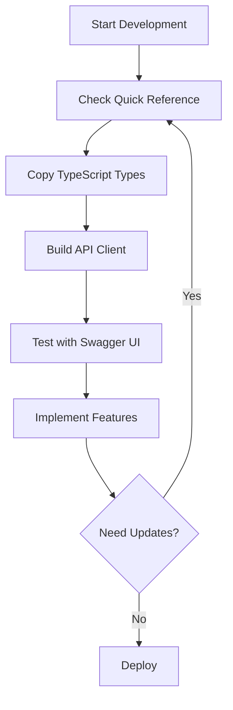

# Frontend API Reference Package

> **Complete API documentation for RSS Feed Backend**  
> Everything your frontend team needs to integrate with the backend API

---

## 📦 What's Included

This package contains three comprehensive documents for frontend development:

### 1. **Quick Reference Cheat Sheet** 📋
**File:** `01-API-QUICK-REFERENCE.md`

A condensed, scannable reference with:
- All endpoints in table format
- HTTP methods and authentication requirements
- Common request/response examples
- Status codes and error handling
- Rate limiting information

**Best for:** Quick lookups during development, onboarding new developers

---

### 2. **TypeScript Types & Interfaces** 🔷
**File:** `02-TYPESCRIPT-TYPES.md`

Complete TypeScript definitions including:
- Request/response interfaces for all endpoints
- Type-safe enums and unions
- API client implementation examples
- React hooks examples
- Redux Toolkit integration patterns
- Zod schema validation examples

**Best for:** Type safety, IDE autocomplete, reducing runtime errors

---

### 3. **OpenAPI 3.0 Specification** 📄
**File:** `03-OPENAPI-SPEC.md`

Full OpenAPI/Swagger specification with:
- Machine-readable API definition (YAML)
- Interactive documentation via Swagger UI
- Postman collection generation
- Client library code generation
- Mock server setup

**Best for:** API testing, code generation, team collaboration

---

## 🚀 Quick Start

### For Frontend Developers

1. **Browse the Quick Reference**
   ```bash
   open 01-API-QUICK-REFERENCE.md
   ```
   Get familiar with available endpoints and authentication flow.

2. **Copy TypeScript Types**
   ```bash
   # Copy types to your frontend project
   cp 02-TYPESCRIPT-TYPES.md ../frontend/src/types/api.md
   # Or extract the code blocks into .ts files
   ```

3. **Test with Swagger UI**
   ```
   Open: http://localhost:8000/docs
   ```
   Interactive testing environment for all endpoints.

### For Project Managers

- **Quick Reference** provides endpoint overview and capabilities
- **OpenAPI Spec** can generate documentation sites and SDKs
- All endpoints are production-ready and tested

---

## 📖 Usage Guide

### Development Workflow



### Integration Steps

1. **Authentication Setup**
   - Implement login/register flows
   - Store JWT tokens securely
   - Add token refresh logic

2. **API Client Setup**
   - Copy TypeScript types
   - Create base API client
   - Add error handling

3. **Feature Implementation**
   - Use Quick Reference for endpoint details
   - Leverage TypeScript types for type safety
   - Test with Swagger UI

---

## 🔧 Tools & Integration

### Postman Collection
```bash
# Import OpenAPI spec to Postman
1. Open Postman
2. Import > 03-OPENAPI-SPEC.md (copy YAML content)
3. Set baseUrl environment variable
4. Start testing!
```

### Generate API Client
```bash
# TypeScript/Axios
npm install -g @openapitools/openapi-generator-cli
openapi-generator-cli generate \
  -i 03-OPENAPI-SPEC.md \
  -g typescript-axios \
  -o src/api
```

### Mock Server
```bash
# Test without backend
npm install -g @stoplight/prism-cli
prism mock 03-OPENAPI-SPEC.md
# Available at http://127.0.0.1:4010
```

---

## 📚 Document Details

### Quick Reference (Cheat Sheet)
- **Pages:** ~6
- **Format:** Markdown tables
- **Use Case:** Daily reference
- **Updated:** 2025-01-27

### TypeScript Types
- **Lines:** 830+
- **Format:** TypeScript interfaces
- **Use Case:** Type-safe development
- **Updated:** 2025-01-27

### OpenAPI Specification
- **Lines:** 1425+
- **Format:** OpenAPI 3.0.3 YAML
- **Use Case:** Tooling, generation, testing
- **Updated:** 2025-01-27

---

## 🎯 API Overview

### Endpoints Summary

| Category | Endpoints | Authentication |
|----------|-----------|----------------|
| **Authentication** | 3 | ❌ Public |
| **Users** | 4 | ✅ Required |
| **Articles** | 3 | 🔓 Optional |
| **Votes** | 3 | ✅ Required |
| **Comments** | 11 | Mixed |
| **Bookmarks** | 8 | ✅ Required |
| **Reading History** | 8 | ✅ Required |
| **Notifications** | 9 | ✅ Required |
| **Total** | **49** | - |

### Key Features

✅ **JWT Authentication** - Secure token-based auth with refresh  
✅ **Reddit-style Voting** - Upvotes/downvotes on articles  
✅ **Threaded Comments** - Nested discussions with voting  
✅ **Bookmarks** - Save articles in collections  
✅ **Reading History** - Track views and engagement  
✅ **Notifications** - Real-time user notifications  
✅ **Pagination** - Efficient data loading  
✅ **Search** - Full-text article search  

---

## 🔐 Authentication Flow

```typescript
// 1. Register/Login
const { access_token, refresh_token } = await login(email, password);

// 2. Store tokens
localStorage.setItem('access_token', access_token);
localStorage.setItem('refresh_token', refresh_token);

// 3. Use in requests
headers: {
  'Authorization': `Bearer ${access_token}`
}

// 4. Refresh when needed
if (tokenExpired) {
  const newTokens = await refreshToken(refresh_token);
  // Update stored tokens
}
```

---

## 🚨 Common Issues & Solutions

### Issue: CORS Errors
**Solution:** Ensure your frontend domain is in `CORS_ORIGINS` (`.env` file)

### Issue: 401 Unauthorized
**Solution:** Check token expiry, refresh if needed

### Issue: Type Errors
**Solution:** Ensure TypeScript types are up-to-date with latest API

### Issue: Rate Limiting (429)
**Solution:** Implement exponential backoff, respect rate limit headers

---

## 📞 Support

### Interactive Documentation
- **Dev:** http://localhost:8000/docs
- **Prod:** https://your-domain.com/docs

### Backend Repository
- See main repository for backend source code
- Check `DEPLOY_TO_STAGING.md` for deployment guide

### Questions?
- Check existing documentation first
- Review TypeScript examples
- Test endpoints in Swagger UI

---

## 🔄 Updates

This documentation is synchronized with backend API version **1.0.0**.

### Checking for Updates
1. Compare API version in OpenAPI spec
2. Check backend `/health` endpoint
3. Review backend release notes

### Updating Documentation
When backend changes:
1. Regenerate OpenAPI spec: `http://localhost:8000/openapi.json`
2. Update TypeScript types accordingly
3. Refresh Quick Reference if endpoints changed

---

## 📝 Contributing

### Reporting Issues
Found an error in documentation?
1. Note the file and section
2. Describe the issue
3. Suggest correction if possible

### Requesting Features
Need additional documentation?
- SDK examples for specific frameworks
- More usage patterns
- Integration guides

---

## ✅ Checklist for Frontend Team

- [ ] Read Quick Reference overview
- [ ] Copy TypeScript types to project
- [ ] Set up API client with authentication
- [ ] Test authentication flow in Swagger UI
- [ ] Implement error handling
- [ ] Add token refresh logic
- [ ] Test key endpoints (articles, comments, votes)
- [ ] Set up proper CORS configuration
- [ ] Implement rate limiting handling
- [ ] Add loading states and error messages

---

## 🎨 Example Projects

### Minimal Example
```typescript
import { ApiClient } from './api/client';

const api = new ApiClient('http://localhost:8000/api/v1');

// Login
const tokens = await api.login({
  email: 'user@example.com',
  password: 'password123'
});

api.setAccessToken(tokens.access_token);

// Get articles
const feed = await api.getArticlesFeed({
  category: 'politics',
  sort_by: 'hot',
  page: 1
});

console.log(feed.articles);
```

### React Hook Example
```typescript
import { useArticles } from './hooks/useArticles';

function ArticlesFeed() {
  const { articles, loading, error } = useArticles({
    category: 'politics',
    sort_by: 'hot'
  });

  if (loading) return <Loading />;
  if (error) return <Error message={error} />;

  return (
    <div>
      {articles.map(article => (
        <ArticleCard key={article.id} article={article} />
      ))}
    </div>
  );
}
```

---

## 📊 Version History

| Version | Date | Changes |
|---------|------|---------|
| 1.0.0 | 2025-01-27 | Initial release |

---

**Package Version:** 1.0.0  
**API Version:** 1.0.0  
**Last Updated:** 2025-01-27  
**Maintained By:** Backend Team
